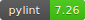

# 📈📉&nbsp;&nbsp;simple-back


[](https://github.com/psf/black)
[](https://codecov.io/gh/MiniXC/simple-back)

[](https://minixc.github.io/simple-back)

## [Documentation](https://minixc.github.io/simple-back)

## Installation
````
pip install simple_back
````
## Quickstart
> The following is a simple crossover strategy. For a full tutorial on how to build a strategy using **simple-back**, visit [the quickstart tutorial](https://minixc.github.io/simple-back/intro/quickstart.html)

````python
from simple_back.backtester import BacktesterBuilder

builder = (
   BacktesterBuilder()
   .name('JNUG 20-Day Crossover')
   .balance(10_000)
   .calendar('NYSE')
   .compare(['JNUG']) # strategies to compare with
   .live_progress() # show a progress bar
   .live_plot(metric='Total Return (%)', min_y=None)  # we assume we are running this in a Jupyter Notebook
)

bt = builder.build() # build the backtest

for day, event, b in bt['2019-1-1':'2020-1-1']:
    if event == 'open':
        jnug_ma = b.prices['JNUG',-20:]['close'].mean()
        b.add_metric('Price', b.price('JNUG'))
        b.add_metric('MA (20 Days)', jnug_ma)

        if b.price('JNUG') > jnug_ma:
            if not b.portfolio['JNUG'].long: # check if we already are long JNUG
                b.portfolio['JNUG'].short.liquidate() # liquidate any/all short JNUG positions
                b.long('JNUG', percent=1) # long JNUG

        if b.price('JNUG') < jnug_ma:
            if not b.portfolio['JNUG'].short: # check if we already are short JNUG
                b.portfolio['JNUG'].long.liquidate() # liquidate any/all long JNUG positions
                b.short('JNUG', percent=1) # short JNUG
````


## Why another Python backtester?
There are many backtesters out there, but this is the first one built for rapid prototyping in Jupyter Notebooks.

### Built for Jupyter Notebooks
Get live feedback on your backtests (live plotting, progress and metrics) *in your notebook* to immediatly notice if something is off about your strategy.

### Sensible Defaults and Caching
Many backtesters need a great deal of configuration and setup before they can be used. 
Not so this one.  At it's core you only need one loop, as this backtester can be used like any iterator.
A default provider for prices is included, and caches all its data on your disk to minimize the number of requests needed.

### Extensible
This is intended to be a lean framework where, e.g. adding crypto data is as easy as extending the ``DailyPriceProvider`` class.
