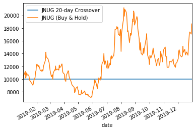
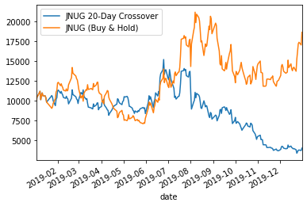
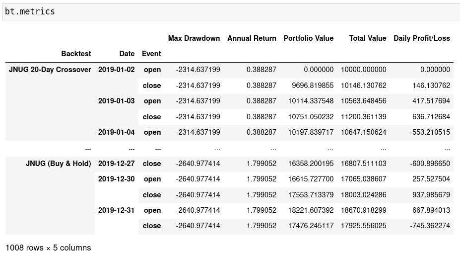

==========
Quickstart
==========

In this tutorial, we will build a `crossover strategy`_ that exclusively
buys and sells **JNUG**. It will enter a long position whenever the price
goes above its 20-day MA and enter a short position when it goes below.

.. _crossover strategy:
   https://www.investopedia.com/articles/active-trading/052014/how-use-moving-average-buy-stocks.asp

Building a Backtest
===================
Use :class:`.BacktesterBuilder` to configure and create a :class:`.Backtester` object::

   from simple_back.backtester import BacktesterBuilder

   bt = (
      BacktesterBuilder()
      .name('JNUG 20-Day Crossover')
      .balance(10_000)
      .calendar('NYSE')
      .compare(['JNUG']) # stragies to compare with
      .live_plot() # we assume we are running this in a Jupyter Notebook
      .build()
   )

Running the Backtest
====================
We can now treat the `bt` object like an iterator with a date index::

   for day, event, b in bt['2019-1-1':'2020-1-1']:
      pass
      # code here will be called on 'open' and 'close' events on trading days

This will gradually draw the following chart:

Note that we wrote ``.compare(['JNUG'])`` before so we could compare our strategy
to just buying and holding **JNUG**. Because we do not do anything so far, the
`JNUG (20-Day Crossover)` strategy results in a flat line.

.. note::
   :meth:`.compare` normally only accepts a list of :class:`.Strategy` objects,
   but for each strings that is passed, it automatically creates a :class:`.BuyAndHold`
   strategy for the symbol represented by the string.

Creating a Strategy
===================
We are now ready to create the strategy.
Although not necessary for this strategy, we will only act on market open
by checking that ``event == 'open'``

We then calculate the 20-day moving average of JNUGs close prices::

   for day, event, b in bt['2019-1-1':'2020-1-1']:
      if event == 'open':
         jnug_ma = b.prices['JNUG',-20:]['close'].mean()

.. note::
   The second argument of ``b.prices`` (implemented in :class:`.DailyPriceProvider.__getitem__`)
   can be a date range or single date
   that allows you to use :class:`int`, :class:`dateutil.relativedelta.relativedelta`
   or :class:`datetime.date` values.

We can check if the current price is above or below the moving average using ``b.price('JNUG')``::

   for day, event, b in bt['2019-1-1':'2020-1-1']:
      if event == 'open':
         jnug_ma = b.prices['JNUG',-20:]['close'].mean()
         if b.price('JNUG') > jnug_ma:
            # price is above MA
         if b.price('JNUG') < jnug_ma:
            # price is below MA

Now we should only need to buy when the price is above, and sell when the price is below the MA::

   for day, event, b in bt['2019-1-1':'2020-1-1']:
      if event == 'open':
         jnug_ma = b.prices['JNUG',-20:]['close'].mean()
         if b.price('JNUG') > jnug_ma:
            b.order_pct('JNUG', 1)  # positive == long
         if b.price('JNUG') < jnug_ma:
            b.order_pct('JNUG', -1) # negative == short

But as you might already have expected, this fails with an :class:`.InsufficientCapitalError`
This is because we repeatedly try to invest 100% of our assets into **JNUG**,
even when we already hold **JNUG** shares.

.. note::
   To buy shares of an absolute value,
   use :meth:`.Backtester.order_abs` instead of :meth:`.Backtester.order_pct`

To fix the previous error we now check if the corresponding positions are already in our portfolio,
and liquidate positions of the wrong kind.
We liquidate long positions before we go short and vice versa::

   for day, event, b in bt['2019-1-1':'2020-1-1']:
      if event == 'open':
         jnug_ma = b.prices['JNUG',-20:]['close'].mean()

         if b.price('JNUG') > jnug_ma:
            if not b.portfolio['JNUG'].long: # check if we already are long JNUG
               b.portfolio['JNUG'].short.liquidate() # liquidate any/all short JNUG positions
               b.order_pct('JNUG', 1) # long JNUG

         if b.price('JNUG') < jnug_ma:
            if not b.portfolio['JNUG'].short: # check if we already are short JNUG
               b.portfolio['JNUG'].long.liquidate() # liquidate any/all long JNUG positions
               b.order_pct('JNUG', -1) # short JNUG

Unfortunately, **JNUG** is unimpressed by our strategy and we end up losing more than 50% in value.

Inspecting Metrics
==================

Now that our Backtest is complete, we can use :py:obj:`.Backtester.metrics` and :py:obj:`.Backtester.summary`
to get more details. Both of these will return `DataFrames`.

Metrics
-------

Summary
-------

.. image:: img/quickstart-df-02.png

Strategies
----------

You can also use :meth:`.Backtester.strategies` which returns a :class:`.StrategySequence`,
with their own :py:obj:`.Backtester.metrics` and :py:obj:`.Backtester.summary`::

   bt.strategies['JNUG 20-Day Crossover'].metrics

Implementation
==============

.. py:currentmodule:: simple_back.backtester
.. autoclass:: BacktesterBuilder
   :members:
   :undoc-members:
   :member-order: bysource
.. autoclass:: Backtester
   :members:
   :undoc-members:
.. autoclass:: StrategySequence
   :members:
   :undoc-members: